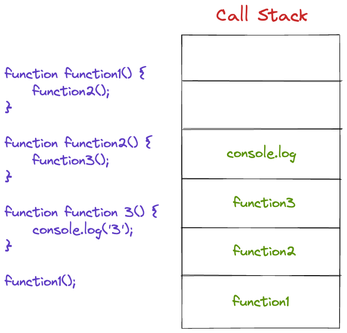

[Home](../README.md)

# Class 10

## The JS Call Stack

1. What is a ‘call’?
  A call is a function invocation.

2. How many ‘calls’ can happen at once?
  In JS, only one call can happen at once (single-threaded / synchronous), so calls are put on a stack, where functions wait to be executed until other functions complete

3. What does LIFO mean?
  LIFO is "last in, first out", meaning that the last item put on a stack is the first item to be accessed or acted on.

4. Draw an example of a call stack and the functions that would need to be invoked to generate that call stack.
  

5. What causes a Stack Overflow?
  Stack overflow is generally caused by recursion with a missing base case that causes an infinite number of function calls to be placed on the stack. The stack is fairly large, but it has a limit that can be exceeded. that is called a stack overflow.

## JS Errors

1. What is a ‘reference error’?
  Trying to use a variable that hasn't been declared yet (or at all).

2. What is a ‘syntax error’?
  When you have a piece of code that's syntax cannot be parsed (often caused by errant punctuation).

3. What is a ‘range error’?
  Range errors are thrown when trying to manipulate the length of something to give it an invalid length (i.e.negative array lengths).

4. What is a ‘type error’?
  Type errors are thrown when you are using functions or methods with incompatible data types.

5. What is a breakpoint?
  A breakpoint is a point in the code where the code will pause execution allowing you to view the state of the code at that point before moving on. You can set multiple breakpoints in your debugger.

6. What does the word ‘debugger’ do in your code?
  It sets a breakpoint in your code itself, as opposed to manually setting it in a debugger or devtools.
