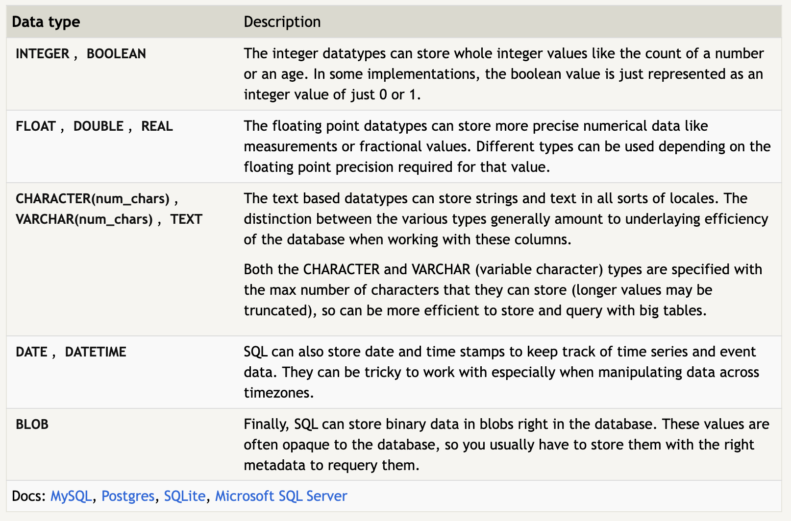
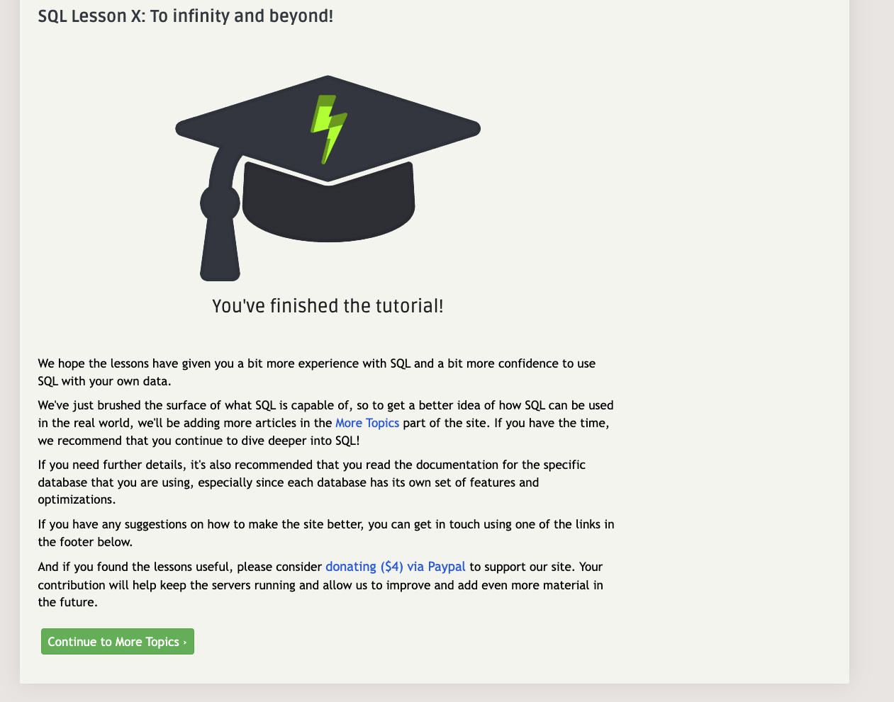

[Home](../README.md)

# Pre-work - SQL

## SQL Summary

- SQL stands for "**S**tructured **Q**uery **L**anguage"
- It is a language that allows us to interact with relational databases.
- Relational DBs store data in tables, with defined columns.
- The relational aspect refers to the ability for different tables to be linked by certain columns and values
- SQL databases are more rigid than NoSQL, but have the potential to be more stable and predictable
- There are generally 8 steps of a SQL Query:

  1. The `FROM` and `JOIN`s that determine which tables will be used
  2. `WHERE` - which filters the data based on provided constraints
  3. `GROUP BY` - groups the remaining data after filtering
  4. `HAVING` - removes remaining rows based on provided constraints
  5. `SELECT` - determines which data to return
  6. `DISTINCT` - removes rows with duplicate values in columns identified as `DISTINCT`
  7. `ORDER BY` - sorts remaining data
  8. `LIMIT` / `OFFSET` - discards rows falling outside the `LIMIT` / `OFFSET`

- Query example:

```SQL
SELECT column1, column2, column3 from table1
INNER JOIN table2 
  on table1.someKey = table2.someOtherKey
WHERE column1 BETWEEN lowerBound AND upperBound
GROUP BY column2
HAVING column2 = someValue
ORDER BY column1 DESC
LIMIT num_limit;
```

- SQL Types:

  - 
  - [https://sqlbolt.com/lesson/creating_tables](https://sqlbolt.com/lesson/creating_tables)

- Tutorial Completion:


