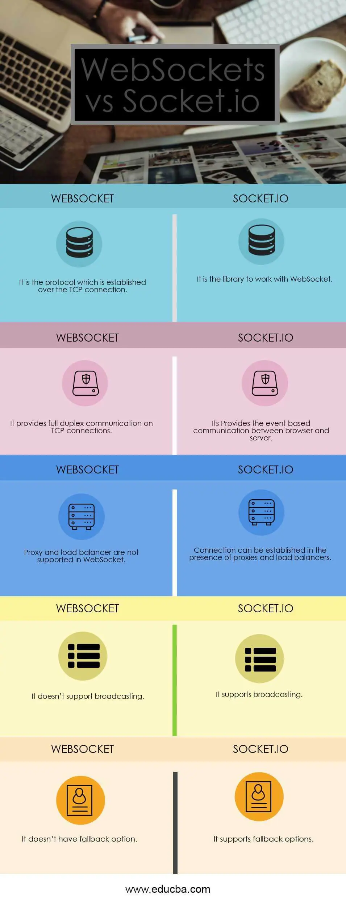

[Home](../README.md)

# Class 12

## Sockets

### WebSocket

- WebSocket is a communication standard providing full-duplex communication channels over a single TCP connection.
- The WebSocket handshake uses an HTTP upgrade header to switch from the HTTP to the websocket protocol
- Websockets enable streams of messages over TCP, whereas standard TCP only uses streams of bytes and has no recognition of what a message is.
- They allow a server to send a message to the client without first receiving a request ffrom the client.
- WebSocket defines `ws` and `wws` ("websocket" and "websocket secure", respectively) as new URI schemes (analagous to `http`/`https`)
- In addition to Upgrade headers, the client sends a Sec-WebSocket-Key header containing base64-encoded random bytes, and the server replies with a hash of the key in the Sec-WebSocket-Accept header. This is intended to prevent a caching proxy from re-sending a previous WebSocket conversation,[40] and does not provide any authentication, privacy, or integrity. The hashing function appends the fixed string 258EAFA5-E914-47DA-95CA-C5AB0DC85B11 (a UUID) to the value from Sec-WebSocket-Key header (which is not decoded from base64), applies the SHA-1 hashing function, and encodes the result using base64. [Websocket - Wikipedia](https://en.wikipedia.org/wiki/WebSocket)

### Socket.io Tutorial

- socket.io is a service that implements and abstracts away some of the compexity of websockets
- It hosts it's own servers, meaning that you can create, subscribe to, and publish to it, but the event pools are implemented and hosted on its own servers.
- Examples of it's usecases include:
  - IMs, push notifications, collaboration platforms, and online games

- the `.on()` method handles new connections and disconnection.
- a proof of life implementation can be the messages logged on connect and disconnect as well as a message sent to the client some amount of time after connect, to prove out the server sending messages to the client sans request.
- `socket.emit()` fires an event of a specified name, allowing any callbacks based off that event to be called by the eventPool. It also contains a payload, similar to the standard node `events` module.
- we can bradcast events simply by subscribing to the same event name on all clients.
- create namespaces using `io.of(/path)`, and join the namespace on the client side with `var = io(/path)`
- similarly we can create rooms or channels by calling `socket.join('msg')` within the `io.on()`. Leave a room with `socket.leave()`
- The following are built-in events:
  - Connect − When the client successfully connects.
  - Connecting − When the client is in the process of connecting.
  - Disconnect − When the client is disconnected.
  - Connect_failed − When the connection to the server fails.
  - Error − An error event is sent from the server.
  - Message − When the server sends a message using the send function.
  - Reconnect − When reconnection to the server is successful.
  - Reconnecting − When the client is in the process of connecting.
  - Reconnect_failed − When the reconnection attempt fails.

- We can handle these errors client-side with whateve3r error-handling callback we choose.
- Socket.io handles fallbacks for various implementation gaps that users/devs are likely to encounter. In the absence of this, we would have to implement these fallbocks ourselves. Examples include:
  - WebSockets
  - FlashSocket
  - XHR long polling
  - XHR multipart streaming
  - XHR polling
  - JSONP polling
  - iframes

- Socket.io adds avents to the messages afforded by WebSocket, which effectively blends node's native `event` module with the WebSocket comunication standard. It handles serialization and deserialization of non-plaintext data
- 

### WebSocket vs Socket.io

- Websocket is a communication standard
- Socket.io is a service that uses the Websocket communication standard and events to allow for easy two-way data flow between client and server, and subsequently between clients. This more complex data formats than just the plaintext messages supported natively by websockets
- socket.io provides the following benefits:
  - It helps in broadcasting to multiple sockets at a time and handles the connection transparently.
  - It works on all platform, server or device, ensuring equality, reliability, and speed.
  - It automatically upgrades the requirement to WebSocket if needed.
  - It is a custom real-time transport protocol implementation on top of other protocols.
  - It requires both libraries to be used Client side as well as a server-side library.
  - IO works on work-based events. there are some reserved events that can be accessed using the Socket on the server side like Connect, message,   - Disconnect, Ping and Reconnect.
  - There are some Client based reserved events like Connect, connect- error, connect-timeout and Reconnect etc.

